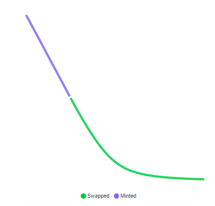
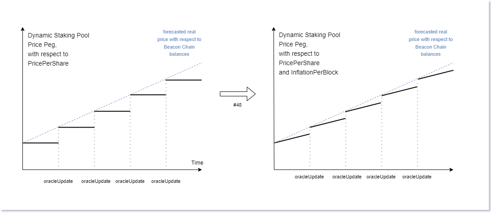

# Auditing Geode

* The code base might seem big. However, most of it either functions referencing Library functions, or comments. So no worries, you will understand everything easily.
* DWP is forked from Saddle Finance.
  * We added dynamic peg, which means price is not focusing around 1:1 but 1:price :)
  * We also added something called `debt`, which is the amount of Ether that is needed to heal to price to peg.
* The dependencies does not require an Audit as zero-to-small changes are made. However we are adding them, with instructions on how to duplicate the changes made on OpenZeppelin contracts and diffchecker links, so you can verify if you want.

* Finally, the withdrawal cycle is designed according to eip-4895, which might not be the final/chosen version. This continues to be a main blocker for the launch of Geode Finance.

## Audit Scope and Details

* Scope:
  * gETH
    * contracts\Portal\gETH.sol
  * DWP
    * contracts\Portal\WithdrawalPool\LPToken.sol
    * contracts\Portal\WithdrawalPool\Swap.sol
      * contracts\Portal\WithdrawalPool\utils\AmplificationUtils.sol
      * contracts\Portal\WithdrawalPool\utils\MathUtils.sol
      * contracts\Portal\WithdrawalPool\utils\SwapUtils.sol
  * Portal
    * contracts\Portal\MiniGovernance\MiniGovernance.sol
    * contracts\Portal\Portal.sol
      * contracts\Portal\utils\DataStoreUtilsLib.sol
      * contracts\Portal\utils\GeodeUtilsLib.sol
      * contracts\Portal\utils\MaintainerUtilsLib.sol
      * contracts\Portal\utils\OracleUtilsLib.sol
      * contracts\Portal\utils\StakeUtilsLib.sol

* Dependencies:
  * contracts\Portal\helpers\ERC1155SupplyMinterPauser.sol : A combination of ERC1155Supply and ERC1155PresetMinterPauser contracts, inherited by gETH.
  * contracts\Portal\gETHInterfaces\ERC20InterfacePermitUpgradable.sol : ERC20InterfaceUpgradable with permit functionality, EIP-2612.
    * contracts\Portal\helpers\ERC20InterfaceUpgradable.sol: A case study on ERC1155Interfaces. Allowing an ERC1155 ID to be used as an ERC20 token.  
  * contracts\Portal\utils\DepositContractUtilsLib.sol: A byte code library for Deposit contract related functions.
  
---
> **A note from 0xIcebear**
>
> Hi :)
> While I am typing these lines, I am watching The Merge.
>
> I believe in a Decentralized Future, and it bothers me a lot that someone can be threatening it.
> It has been over a year now, since we realized the risk.
>
> We worked hard, day and night, for months, with no visibility... just to contribute.
> We had no idea what we were going to build at the beginning.
> I like what we have coded.
>
> Here, my telegram: @icebearDefi
> If it makes this process faster and cheaper :P Please don't hesitate reach out to book multiple calls, whenever you want.
> I can explain any concepts that you are having a hard time understanding.
> 7 days a week, I will be available.
>
> Cheers.

# Geode

Geode Finance is built by contributors, bothered by the centralization and unfair monopolization of Liquid Staking Derivatives (LSDs). There is an urgent need for a viable solution. We didn’t want to just bring another Staking-as-a-Service product to the market, but rather change the way staking works.

Thus, we should underline that Geode Finance is not another Staking-as-a-Service provider.

Geode Finance Team have been researching the understanding the Liquid Staking Derivatives since September 2021.

1. Define what made LSDs special.
2. Research the issues with its current design.
3. Propose solutions on how to overcome these issues.
4. Experiment to see if it possible to implement these solutions in the current state of Ethereum PoS.

# 1. Understanding The Issue

## The Issue

There are 3 main issues with the current design of the LSD market. Anyone who can solve them shall revolutionize the future of Decentralized Finance.

1. Monopolization
2. Trust
3. Sustainability

> These all are significantly related to each other. But during our research we concluded that it all comes down to one: *Trust*.

To overcome them, we need to improve our understanding of LSDs.

We now believe, there is "a" solution.

## Monopolization

Liquid Staking Infrastructures are no joke, they are very sensitive and require a lot of attention to detail.
Even within the short period since Serenity Phase 0, we have witnessed multiple of them failing to deliver, mistakenly losing user funds or evidently rugging.
> Resulted in costumers to choose trusted pools over smaller ones.

Naturally, it costs a lot to build and maintain SaaS pools.
> Discouraged the builders, even more, resulting in less competition for big, greedy staking pools.

Finally, Liquid Staking Derivatives required an assertive amount of liquidity source to ensure the `Price Peg`.
> Created an environment where it is near impossible to fight with the big guys.

## Trust

There are points that requires trust. Currently, all are susceptible to single-point failure. While talking about these issues we will keep centralized parties, like CEXes, out of scope.

1. Upgradable Contracts:

> One can't have immutable implementations in an environment where everything changes fast. But it is not acceptible that a "Withdrawal Contract" can be held prisoner by someone who has more than 50% of a governance token.

2. Assumptions on Node Operation:

> It is not possible to enforce a Validator to unstake. If a Node Operator chooses to keep them going, there is nothing a derivative token can do.

3. 3rd Party Risks:

> When a LSD token is onboarded to a new protocol, that protocol becomes susceptible to the bound risks. **The impact of failure is not isolated, but rather spread further.**

## Sustainability

Simply, "the yield" is not sustainable.

An LSD can grow fast in an unhealthy, speculative environment.
It can acquire a big proportion of the marketshare within a short period of time with unsustainable incentives.
It's fall is inevitable when the market rejects/forgets it.

We understood that the Intermediary Staking Tokens, ERC20s that are created by the service providers, will not provide better, unprecedented yields compared to the staking rewards.
This achievement requires an environment where there is a demand for the secondary asset.

This requires a monopoly.

# 2. An Idea: `Dynamic Liquid Staking Pools`

The solution is to create a Factory, that will create and maintain `Trustless and Healthy Liquid Staking Derivatives`. Allowing anyone - a DAO, a wallet, a bridge, a CEX, a hedge fund, a person - to easily own one. Thus allowing any party to manage their own risk, isolating the risk of failure, encouraging the market to support a pool with any size -as there is a global standart-, and finally removing the need for the Intermediary Staking Tokens (ERC20s).

The solution is as Trustless as it goes. It claims to solve the trust, monopolization and sustainability issues while creating a free market where all participants are responsible from their own actions within explicit restrictions on their interactions. A free market, where one's benefit is everyone's benefit.

Understanding it requires a basic understanding of the Game Theory and Race Conditions.

> We will gamify the implementation with Star Wars references. Hope you enjoy it.

# 3. Geode Portal

Geode Portal uses multiple contracts and libraries to convert multiple complex tasks into a simple and easy to understand flow.
The main goal is to ensure the future upgrades can achieve the desired final implementation, while keeping these tasks as trustless as possible.

## gETH

gETH is a simple ERC1155 contract with additional, special functionalities. gETH should be seen as the base contract for the `balances` and `prices` data for any derivative maintained by Portal.

* Included price logic tracks the underlying ratio with staked asset, ETH.
  * To allow basic functionalities to build on top of gETH, we also keep the timestamp of the latest price updates.
* Most important improvement is the implementation of ERC1155Interfaces:
  * Interfaces allow any token ID to act with different functionalities as default. Meaning one ERC1155 id can act like erc20, or it is even possible to build a whole protocol on top gETH and use it as an internal database for balances and prices.
  * One can avoid the use of interface by simply calling `avoidInterfaces`.

## DataStore Library

Like any multiplayer game, there are multiple parties with different `Type`s.
Every party has a unique `ID`, that is derived by `keccak(name, type)`.
Every `Type` has unique actions and objectives.
Every `ID` has a `CONTROLLER` address, who controls the ownership of the ID.

`ID` can represent the gETH id of a pool, a contract upgrade or a Senate Election etc.  
> DataStore allows the creation of dynamic structures that can have as many keys as possible.
> DataStore is maintained by GeodeUtils Library.

## GeodeUtils Library

A library to ensure the "global trustlessness" of Geode with Senate/Governance functionalities.

> Senate is the protector of all citizens, protecting them from a greedy/malicious Governance.

Includes a logic to:

1. Governance functionalities, such as proposing a new Planet or a new Node Operator, proposing a contract upgrade, or proposing a new Senate.
2. Cover `Limited Upgradability` where it is required to have the approval of Senate on the Governances proposals. Most importantly, while upgrading to the Portal's implementation (TYPE 3).
3. Senate functionalities. Such as limiting the Governance Tax, updating the required parameters such as MiniGovernance version-id (TYPE 11), approving to onboard an Operator or a Planet (Type 4 and 5).
4. Senate Elections, where the electors are Planet `CONTROLLER`s (TYPE 2).

## MaintainerUtils Library

Maintainers are chosen by CONTROLLERs. `Maintainer` can be seen as a *Parent Class* to any TYPE that are implemented on StakeUtils, such as Operators, Planets and Comets. This Library built on top of DataStore; initiating, authenticating and simplifying the management of such IDs with different TYPEs.

The patterns that are implemented should make it easy to maintain these IDs, while allowing Maintainers to benefit from their contribution.

1. **Planets**: Public Staking Pools, not permissionless to create but permissionless to use.
   1. Planets have maintainers that manage the Node Operator allowances, acting like every possible Validator is "1" balance.
   2. Keeping the derivative healthy and sustainable with cooperation to the Dynamic Withdrawal Pool.
   3. Incentivising the withdrawals with `withdrawalBoost` to create a race condition between Node Operators when needed.
   4. Planets use DWP for instant withdrawals.
   5. Also Planet inherits Operator, meaning Planets are authenticated to act as Node Operators as well.
2. **Comets**: Private Staking Pools, permissionless to create but not permissionless to use.
   1. Meaning only maintainers can mint new tokens, however anyone can withdraw.
   2. Withdrawals are conducted with a Queue.
   3. This TYPE is not implemented yet.
3. **Operators**: Node Operators that are responsible from the creation of Validators on behalf of the staking pools.
   1. Proposes new Validators after getting an approval from the Staking Pool's maintainer.
   2. Racing with other Operators to Unstake and acquire the `withdrawalBoost`.
   3. Operates within some requirements, can be isolated by `prison` (More details below).

## OracleUtils Library

Telescope is our Holy Oracle. Currently, It is operated by a multisig, which we proposed to be same as the Senate. To improve trustlessness, we might improve this component in the future.

It has 3 functionalities:

### Distributing the Yield

Telescope updates the PPS (`pricePerShare`) of every gETH ID with `reportOracle` function. However, since we are not willing to send data for thousands of Private Pools in the future, Telescope sends a Merkle Root. Function calculates the Planet prices and then verifies the merkle-root. Planet pool prices are updated afterwards.
> Private Pool prices can be synced by anyone with the correct merkle-proofs. Price sync is required whenever a deposit or a withdrawal operations are requested.

### Regulating the Market

There are 4 forbidden acts, and Telescope regulates them by `regulateOperators` with an Optimistic approach.

Actions that can cause imprisonment:

1. Alien Proposals: Simply validator credential frontrunning (<https://bit.ly/3Tkc6UC>). This would jeopardize the user funds. Operator is imprisoned for a while (currently 15 days) as a punishment.
2. Busted Signals: Operator signaled an unstake, but did not unstake. Operator did not respect the game. Operator is imprisoned for a while (currently 15 days) as a punishment.
3. Validator Unstaked without a signal. Operator did not respect the game. Operator is imprisoned for a while (currently 15 days) as a punishment.
4. Validator is not exited by Operator although the `expectedExit` has past. Anyone can blame a validator and effectively imprison the Operator until the exit happens.

None of these actions provide any benefits to Operators, and there is no way to be prisoned without a malicious intent.

> **What happens when an operator is prisoned?**
>
> 1. Can not propose new validators.
> 2. Can not stake to beacon chain for previously accepted validator proposals.
> 3. Can not access to `maintainerWallet`, effectively, can not claim their rewards.

### Fetching the Unstakes

Currently, Telescope fetchs the unstaked Ether from `MiniGovernances` and uses it to pay DWP debt and maintainer fees. Remaining funds are put in the `surplus` of the pool for depositors to use it as an exit liquidity or operators to create new validators.

> This functionality should be improved to decrease costs and increase security, in the future.

## StakeUtils: Dynamic Liquid Staking Derivatives

This library contains the main functionality of Portal: **Creation and Maintenance of multiple Dynamic Staking Derivatives in a healthy, trustless way**

> Above figure represents the price curve that is created with a relation to the `Surplus` and `Debt`. Green part is pricing during `Resurrection Phase` caused by Debt, and purple part is pricing during `Growth Phase` caused by Surplus.

### DWP: **Dynamic Withdrawal Pools**

The traditional Staking process establishes 3 states with Staking/Unstaking functionalities from the perspective of the staker:

1. Liquid State
2. Locked State
3. Withdrawn State

Dynamic Withdrawals allows this process to be available at a Liquid State all the time.

Dynamic Withdrawals is conducted on a StableSwap pool with a **dynamic peg** relying on gETH PPS. Designed to satisfy any amount of withdrawal requests instantly.
When any of the Locked funds are progressed to the Withdrawn or Liquid State on the consensus layer, withdrawal is finalized with a buy-back & burn on the execution layer, which heals the price as a result.

Any request with excessive amounts should be spread over time, which is absolutely shorter than the initial Locked Period. Thus, creating an equilibrium between price, amount and time.

As a result there is 3 States for a Staking Pool:

1. Growth Phase: the price is stable, Staking Pool has 0 debt to the Withdrawal Pool, new validators are created with the surplus.
2. Stable Phase: there is little to no debt or surplus in the staking pool. No new Validators are created.
3. Resurrection Phase: there is a depeg, resulting in a substantial debt for the Staking Pool. Validators are unstaked to pay the debt and heal the price.

### Surplus and Debt

* Surplus: a joint parameter of DWP and the Staking Pool, which is the amount of Ether that is waiting to be used to create new validators.
* Debt: a DWP parameter, amount of Ether that is needed to be paid to the pool to heal the peg.

When a new deposit happens, Portal checks the debt.
If there is any amount of debt, meaning there is a depeg, Portal pays the debt, thus healing the peg.
This process also gives a better price to the depositor, compared to minting, creating a race condition between depositors.
Making the derivative healthier.

> After a `Boostrap Period`, which is currently 6 months, Surplus can be used for withdrawals as well. This provides zero-slippage exits through DSP.

When there is a surplus there can't be a debt, vice-versa.

### Withdrawal Boost

Normally, the arbitrage opportunity that is captured by DWP is given as a profit to the stakers as a mathematical result of buyback&burn.
Meaning it gets more profitable to stay in the Dynamic Staking Pool and not unstake, in case of a depeg. It is also cheaper to get in.
Effectively incentivising anyone who helps protecting the peg.

However, if the maintainer wishes, `withdrawalBoost` can be used to create a "Race Condition" between all of their Node Operators.
This happens because arbitrage (in terms of Ether) decreases as validators exited and peg is healed.
Meaning the first exiting validator gets the best bribe.
To preserve the race conditions, Operators call `signalUnstake` as soon as they initiate exiting, and lock the `withdrawalBoost` as a percentage while notifyng other Operators about their unstake.

Operators can rotate validators immadiately after withdrawal and create new ones if enough surplus and allowance is available.

### Mini Governances

Basically, every pool either a Comet or a Planet has their own Withdrawal Credential contract that uses GeodeUtils logic on their upgrades. Meaning Contract Upgrades require the approval of the Maintainer.

> We even implemented a protection mechanism with passwords to protect these contracts from a malicious Portal.

This is a good start to ensure that the future implementations will be enforced to incentivise the trustless behaviour!
The end goal is to create mini-portals with more security around MiniGovernance contracts. Like `IsolationMode`, which will allow Portal-less withdrawals.

## WIP: Comets

Private Pools would be the type of Staking Pool that a person with individual funds, a centralized entity that wants to regulate their own Derivative like CEXes or Hedge funds, or any protocol that rather Withdrawal Queue over DWP use to remove the third party risk. They can easily initiate an id and immidiately start working with Industrial Node Operators that they choose.

However, the end goal for private pools is to allow solo stakers to run and maintain their Nodes without any fees or added risk compared to using ETH2Deposit Contract. If we can achieve that, everyone can be their own Saas.

# 4. Conclusion

* We have underlined the usefulness of gETHinterfaces, one can build a protocol on top of gETH and start using it as an internal database.
* We demonstrated that there is no Contract upgrade risks as MiniGovernances are protected by their Maintainer, and Portal is protected by an elected Senate. Senate can not cause harm but only accept or veto Governance proposals to ensure a secure environment for all Operators, Comets and Planets.
* We also want to underline that, currently, Governance does not collect any tax from the staking rewards. Thus allowing anyone, mainly any protocol with a community, to generate sustainable revenue while securing their user's derivative without any ongoing maintenance costs or fees.
* We demonstrated that a DAO can control their Pool with a Governance token. As it is now very easy to do so, with Controller/Maintainer logic.
* We have explained how we are solving the Sustainability Issue* with a general approach on Staking Derivatives with Dynamic Staking Pools. If DWP is strong, the Derivative is strong.
  * But, the assumption of trustlessness and healtier approach to minting/burning with surplus/debt calculations makes it strong to begin with. So, it is not hard to get visibility and attract depositors for smaller pools now.
* We demonstrated that, protocols are encouraged/incentivised to use their Isolated Staking Pool and capture the yield, TVL and Fees to themselves instead of giving it away to third party providers; while managing their own risk profile without any 3rd Party risks.
* We have shown that how withdrawals are incentivised with `withdrawalBoost`, and forced by explicit and fair `operator regulations`. Thus creating a free marketplace with race conditions between all parties, that are trying to achieve the ultimate `peg` by capturing the arbitrage opportunity from DWP.
* We have finalized that there are no one party that can harm the others for any benefits but rather everyone is incentivised to keep. the. game. going.

# 5. Roadmap and Planned Improvements

## Improving DWP pricing with expected yield

Currently the price scaling calculation is made with priceIn and priceOut functions. This means price is steady during the day but has sudden strikes on every oracle update. However, price is (mostly) always steadily increasing with every beacon chain block.
We can assume that there is a yield acquired on every block and smoothen the pricing curve. Finally, it is important to keep the mentioned `peg increase per block` as low as possible to avoid mispriced withdrawals.

## Improving MiniGovernances

* MiniGovernance will be a mini-Portal, allowing sub-Governances to delegate validators through these contracts without touching Portal.
* MiniGovernance will have an improved *IsolationMode* that allows people to withdraw directly from them instead of using Portal.

## Decentralized General Purpose Node Operators

* We may or may not work on decentralized Operators to allow anyone to become a Node Operator under Geode Finance. By enabling permissionless Node Operators we can improve the marketplace, however we have doubts on that if this a job for Geode or not.

## Auto Staking Contracts

* Auto-staking contracts utilizes the idle ETH, sitting in the contract, with improved yields provided by (PoS)Staking. We kept them in mind while implementing the Geode, and took firm steps forward to ensure that any protocol will be able to create a staking pool that can be used within auto staking contracts for various use cases, that doesn't require idle asset's availability all the time.

---
Finally, I want to say that there are still things that we need to improve before going live, but we are excited to see Geode live soon!
