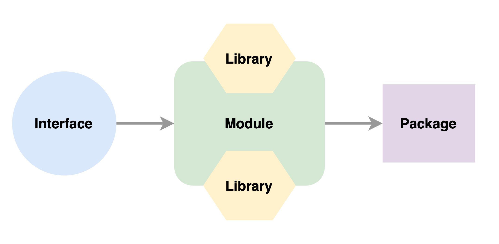

# The Staking Library, on Ethereum

The Staking Library is a first of its kind on-chain library that allows the creation of Staking Pool "instances", providing customizable functionality for all staking related needs on the Execution Layer.

The usage of `library` should not be confused with the reserved solidity key `library`. Instead, it refers to the `library` defined within the scope of programming languages: A collection of prewritten code that can be used to optimize tasks. This collection of code is usually targeted for specific common problems. This is similar to the Portal's ability of providing multiple functionalities with customizability, and maintaining a set of smart contracts that can be deployed, upgraded and utilized by various types of users, permissionlessly.

In-depth understanding of EVM suggests that Ethereum is just a distributed computer. By that logic, smart contracts are no different than standard packages a python developer utilizes on their script. However, the approach to smart contract development focusing on protocols is so far user-centric. In past, developers discovered tools to distribute packages and maintain them, like git, making common functionalities easily accesible. Can we also distribute packages directly within Ethereum without distrupting the trustlessness, the novel idea of smart contracts?

To achieve this, Portal utilizes a version management pattern, LUP (Limited Upgradability Pattern), which is built on top of UUPS:

* User can deploy an UUPS proxy using a Remote Contract.
* Newly deployed contract delegates its functionality to the latest implementation contract.
* Newly deployed contract is used and controlled by the user.
* Remote Contract points to a referance of the latest version of the implementation contract.
* Parent can release a new version.
* Upgrading an instance is not mandatory.
* Owner can upgrade the code of the contract by pulling the address of the new implementation contract from the Remote Contract.
* However, Owner can not change the code randomly.

In conclusion, Portal aims to make all functionality related to staking available on demand, easily accessible. Thus, Geode aims to remove the need for centralized or decentralized intermediaries that are surfaced as an undesired outcome of the lack of functionality on the Execution Layer.

> For more information on the functionality of this repository please see [our documentation](https://docs.geode.fi).

## Contracts

A better, cleaner and safer development environment with Modular Architecture.

The Staking Library utilizes a Modular Architecture. Meaning all functionality is isolated within modules, to be used, inherited and combined by the packages. Modules also do not contain much functionality as they delegate to libraries. Making sure that shared logic among between package are compatible. Because, modules are abstract contracts that can not be deployed and delegated, but libraries are.



**There are currently only 3 packages**: Portal, Liquidity Pool and Withdrawal Contract. However, there can be more modules and packages implemented later.

Additionally there are other contracts such as gETH, an ERC1155 contract, and its middlewares allowing every ID to have its own functionality.

> For more information on the architecture of the smart contracts please see [this document](./contracts/Portal/Readme.md).

## Development

1. Clone this repository:

```sh
git clone https://github.com/Geodefi/Portal-Eth
cd Portal-Eth
```

2. Checkout to dev repository

```sh
git checkout dev
```

3. Create `.env` file, similar to [this](.env.example)

> If mainnet is not forked, some tests related to ETH2 deposit contract may fail.

4. Build the repository

```sh
npm install
```

5. Compile the contracts

```sh
npx hardhat compile
```

> For faster compilation use a local compiler:
>
> 1. Right click on a smart contract
> 2. Choose `Solidity: download compiler and set workspace local path`

### Testing

All unit tests are implemented within the [test folder](./test/).

To run all tests:

```sh
npx hardhat test
```

To run just one test:

```sh
npx hardhat test path/to/test/file.test.js
```

To generate a coverage report:

```sh
npx hardhat compile --force
npx hardhat coverage
```

### Deployments

There are no deployments here.

## Contributing

See our [contributing guide](./docs/GUIDELINES/CONTRIBUTING.md).

## Auditing

It is advised to audit these smart contracts with the order of:

1. [gETH](./contracts/Portal/gETH.sol)
2. [Middlewares](./contracts/Portal/middlewares/)
3. Modules
   1. DataStore Module
      1. [DataStoreModuleLib](./contracts/Portal/modules/DataStoreModule/libs/DataStoreModuleLib.sol)
      2. [DataStoreModule](./contracts/Portal/modules/DataStoreModule/DataStoreModule.sol)
   2. Geode Module
      1. [GeodeModuleLib](./contracts/Portal/modules/GeodeModule/libs/GeodeModuleLib.sol)
      2. [GeodeModule](./contracts/Portal/modules/GeodeModule/GeodeModule.sol)
   3. Stake Module
      1. [DepositContractLib](./contracts/Portal/modules/StakeModule/libs/DepositContractLib.sol)
      2. [StakeModuleLib](./contracts/Portal/modules/StakeModule/libs/StakeModuleLib.sol)
      3. [OracleExtensionLib](./contracts/Portal/modules/StakeModule/libs/OracleExtensionLib.sol)
      4. [StakeModule](./contracts/Portal/modules/StakeModule/StakeModule.sol)
   4. Liquidity Module
      1. [LiquidityModuleLib](./contracts/Portal/modules/LiquidityModule/libs/LiquidityModuleLib.sol)
      2. [AmplificationLib](./contracts/Portal/modules/LiquidityModule/libs/AmplificationLib.sol)
      3. [LiquidityModule](./contracts/Portal/modules/GeodeModule/GeodeModule.sol)
4. Packages
   1. [Liquidity Pool Package](./contracts/Portal/packages/LiquidityPool.sol)
   2. [Withdrawal Contract Package](./contracts/Portal/packages/WithdrawalContract.sol)
5. [Portal](./contracts/Portal/Portal.sol)

## Licensing

This section will be updated with a proper license.
