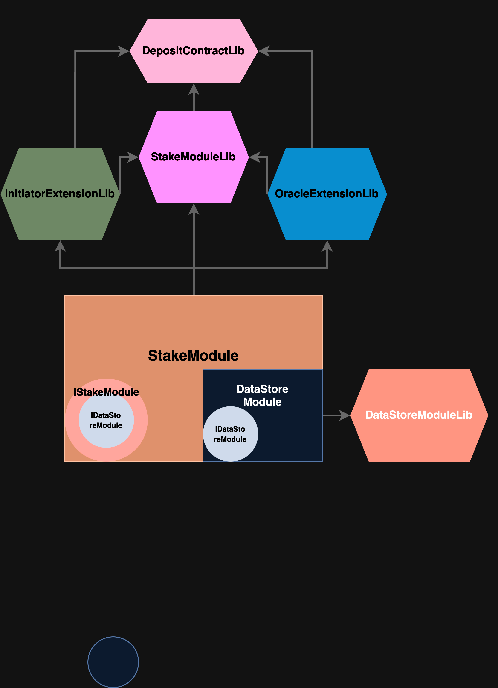
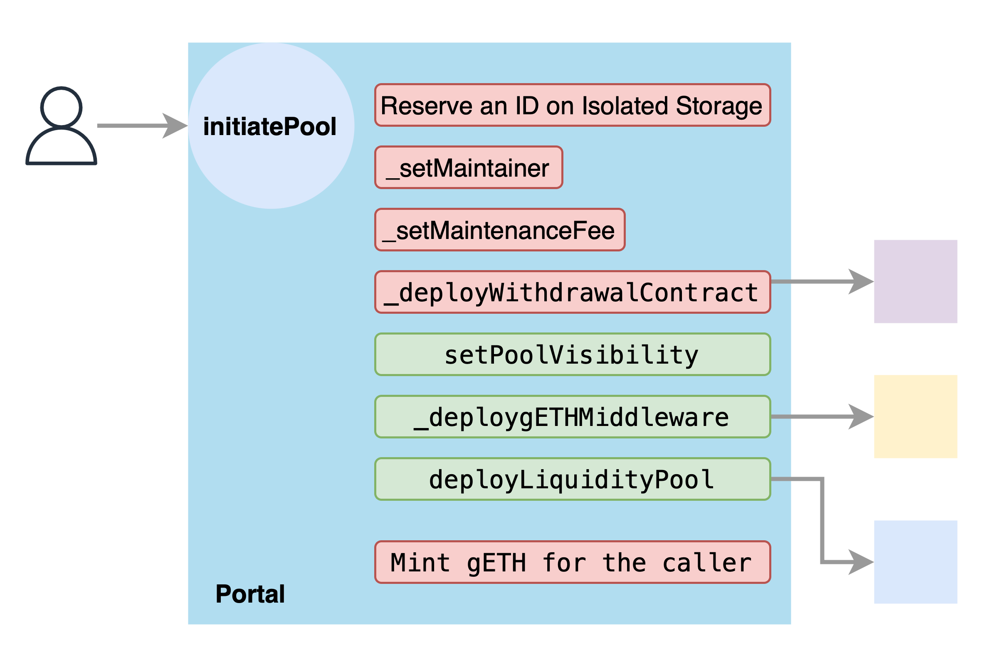
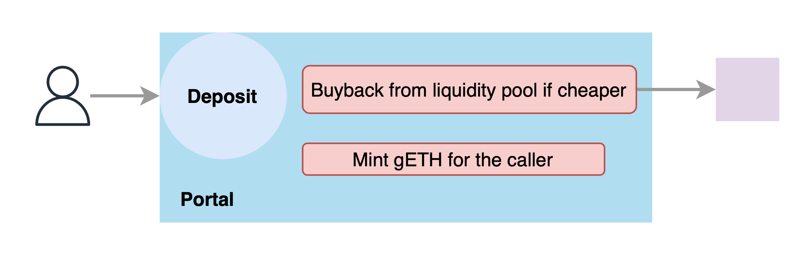
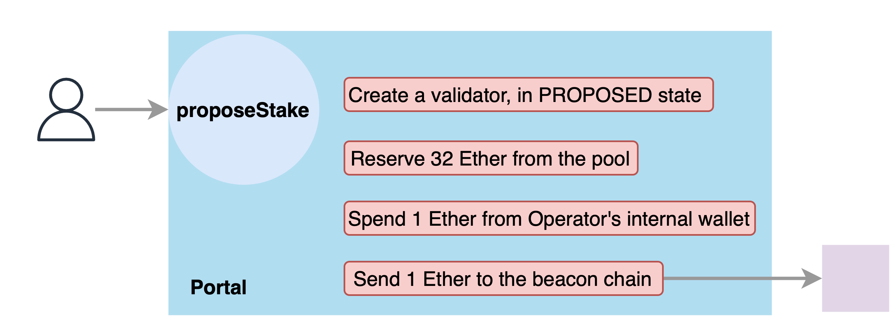

# Modules

The Staking Library utilizes The Modular Architecture and Separation of Concerns. Modules are the essential building blocks of Packages.

## Separation of Concerns

Defining the range of functionalities and grouping them, isolating them from other functionalities results in a safer development environment.

We isolate the functionalities within Packages with Modules. We then, isolate the functionalities within  Modules with Libraries.

> An example module architecture:

* A Module contains a predefined set of an isolated functionality that will be utilized by [Packages](../packages/).
* Modules can not have storage variables other than its main struct which is defined within the its main library.
* Modules are not solely built for Packages, a Module can be built on top of other Modules.
* Modules should inherit the corresponding interface from [interfaces folder](../interfaces/).
* Module contracts are **abstract** meaning they can contain functions that are not implemented, and can not be deployed without being used within a package.
* Module contracts should not contain functionalities. Instead it should delegate all its functionality to the libraries. However, there can be some exceptions:
  * Geode Module is built on top of UUPS. Managing the UUPS logic can not be delegated to the library.
  * Stake Module combines StakeModuleLib and OracleExtensionLib. To provide some combined functionality, it modifies the `deposit` function.

---

# Contents

## **DataStore Module**

DataStore Module is designed to host multiple parties with different TYPEs without them affecting each other's storage space under any condition.

This is achieved by utilizing ID and key pairs within the storage.

> Keys should be imported from rks, [Reserved Key Space](../globals/reserved_key_space.sol).

DataStore can only store 3 types of variables: UINT256, Address, Bytes.
Worth noting, DataStore not only can store these types, but can also store Arrays of these types and relational data between different IDs by generating a new key for the unqiue combinations.

## **Geode Module**

### Dual Governance

Extending the functionality of DataStore Module with **Proposals**.

* Proposals are separated from the Isolated Storage.
* Every Proposal has a NAME, TYPE and CONTROLLER.
* ID is generated from the hash of NAME & TYPE.
* A Proposal is: A Governance asking the of permission A Senate to allow given ID to be allocated to given CONTROLLER.

Thus, A Dual Governance is achieved.

Any Contract that requires a Dual Governance for it's management should inherit GeodeModule.

### Limited Upgradability

The first use case of Dual Governance is upgrading the code of a package.

With another contract that acts like a version manager (as Governance), which is Portal (Except for the Portal which manages its own version with an external Senate), we can release new versions for the Packages without distrupting the owner's control.

## **Liquidity Module**

Contains a Stable Swap implementation that is specifically designed for gETH, an ERC1155 token. Enabling liquidity between 1 token ID and Ether.

## **Stake Module**

Contains the logic of pooled Ether Staking.

We will review this logic by dividing it into 6 sections:

### Staking Pool Initiation

An already claimed ID can not be initiated as a POOL. It is also practically impossible to brute force an ID that is not claimed, but in use.

> Initiating a Pool requires 1 validator worth of Ether to be deposited in the pool. This prevents spam.

This process results in:

* Reserving an ID within the Isolated Storage with the TYPE of POOL(5):
  * Being the CONTROLLER of given ID.
  * Reserving the same ID for gETH.
* Setting the initial structure of the Staking Pool:
  * Setting the maintainer of the Pool.
  * Setting the visibility to either private or public.
  * Setting the pool's maintainance fee.
  * Setting  
  * Deploying the latest version of the Withdrawal Contract Package.
  * Optionally deploying the latest version of the Liquidity Pool Package.
  * Optionally deploying a gETH Middleware that is bound to given ID, using the setting that is provided by the user:
    * Middleware ID among the allowed implementations of the gETH Middlewares.
    * Middleware data that contains the token name and symbol.

Additionally a Pool CONTROLLER can change some settings after the initiation:

* Deploying a Bound Liquidity Pool.
* Setting the Pool visibility and setting a whitelist if the pool is set to private.

### ID Management

Every Operator and Pool has an ID. Some parameters of the ID are open to the manipulation of the CONTROLLER:

* Maintainer
* Internal wallet: Used by the Operators on validator creation process. Also accumulates the maintenance fees.
* Maintenance Fee: Effective on the validators that are created afterwards. Changes are effective after a switching period, which **takes 3 days**.
* Validator Period: Only available for Operators. Changes are effective after a switching period, which **takes 3 days**.

### Pooling

Simply, stakers can deposit Ether and mint gETH.

* Private pools only allow whitelisted addresses and pool CONTROLLER to deposit.
* If Liquidity Pool is in isolation mode, Portal does not trust it and just mints.
* If Withdrawal Pool is in isolation mode, Portal does not trust the Pool and does not mint at all.

### Validator Delegation

Operator Marketplace is simply where Pools choose their Operators.

* Pools choose a subset of Operators and specific allowances which will defined the maximum number of validators given Operator can create.
* Pools can set a fallback Operator which will be active if 80% of the all allowances are filled at any point.

### Validator Creation

Validator creation is 3 step process, this is because there is a frontrunning bug that can be abused by the Operator: <https://bit.ly/3Tkc6UC>

#### Validator Proposal

* If Withdrawal Pool is in isolation mode, Portal does not trust the Pool prevents validator proposals.

#### Proposal Approval

Oracle approves the validator if all looks good.

#### Validator Activation

If a validator proposal is approved by the Oracle, it can be activated by using the pool's funds.

### Oracle Operations

1. **Confirming validator proposals**
     * 2 step process is essential to prevent the frontrunning with a problematic withdrawalCredential: <https://bit.ly/3Tkc6UC>
     * Simply, all proposed validator has an index bound to them,
     * n representing the latest proposal: (0,n]
     * Telescope verifies the validator data provided in proposeStake:
     * especially sig1, sig31 and withdrawal credentials.
     * Telescope confirms the latest index verified and states the faulty validator proposals (aliens)
     * If a validator proposal is faulty then it's state is set to 69, refer to globals/validator_state.sol

2. **Regulating the Operators**
    * Operators can act faulty in many different ways. To prevent such actions,
    * Telescope regulates them with well defined limitations.
    * Currently only issue is the fee theft, meaning operator have not
    * used the withdrawal contract for miner fees or MEV boost.
    * There can be other restrictions in the future.

3. **Continous Data from Beacon chain**: Price Merkle Root & Balances Merkle Root &
    * Number of active validators are used to determine the Operators that control more than 1% of the chain, if any.
    * Balances Merkle Root is used within the withdrawal process.
    * Price Merkle Root is used to update the gETH price:
      1. Oracle Nodes calculate the price of its derivative, according to the validator data such as balance and fees.
      2. If a pool doesn't have a validator, price kept same.
      3. A merkle tree is constructed with the order of allIdsByType array.
      4. A watcher collects all the signatures from Multiple Oracle Nodes, and submits the merkle root.
      5. Anyone can update the price of the derivative  by calling priceSync() functions with correct merkle proofs
      6. Minting is allowed within PRICE_EXPIRY (24H) after the last price update.
      7. Updates the regulation around Monopolies and provides BALANCE_MERKLE_ROOT to be used within withdrawal process.

*

## **Withdrawal Module**

To be implemented.
