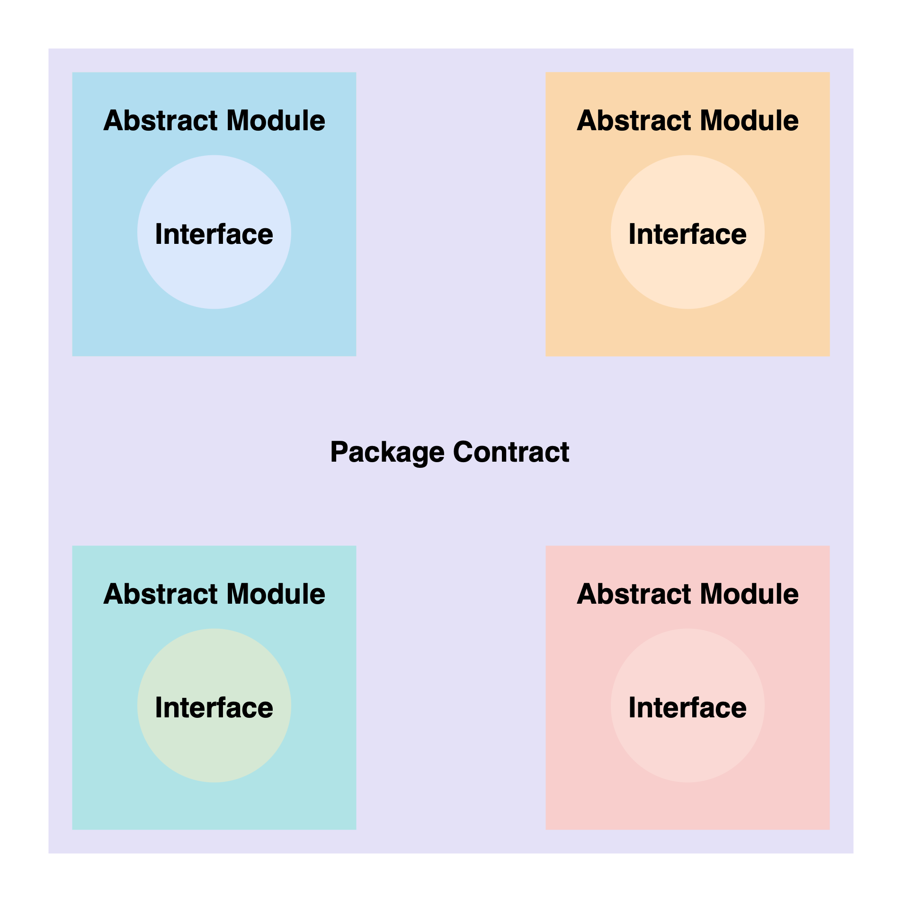

# Packages

## Separation of concerns

Geode utilizes Modular architecture for the smart contract development of The Staking Library.

The Staking Library is built package by package. Every package has a unique functionality. Isolating the risk within the related scope.

Packages inherit modules for the necessary functionalities and combines them. So, a package is just a combination of different Modules with the least amount of additional implementation. They can also share similar functionalities by inheriting the same module, keeping our code cleaner and therefore secure.

## IGeodePackage

All packages should utilize the **Limited Upgradability Pattern**, relying on Portal for their version management. Thus, all packages except Portal is a GeodePackage, inheriting **GeodeModule** and **IGeodePackage** interface.

All packages, including Portal has a unique TYPE (uint256) that separates it from the other TYPE of packages.

## Limited Upgradability Pattern

> Portal is a special package within The Staking Library. It is responsible from the package releases and version management.

1. The implementation contract for the new version of a package is deployed.
2. Governance proposes the new version to the Senate of the Portal.
3. Senate approves, and the referance for the last version of the package is changed.
4. Package goes under, isolation mode per GeodeModule, signaling it is not compatible anymore.
   * Isolation Mode is only externally effective, meaning it does not change any internal functionalities within the package.
5. Owner of a package with an old version can choose to upgrade their package.

## Contents

* [LPP / Liquidity Pool Package](LiquidityPool.sol): Combines GeodeModule with Liquidity Module. Allowing every staking pool to have a built-in liquidity pool.

* [WCP / Withdrawal Contract Package](WithdrawalContract.sol): To be implemented.
