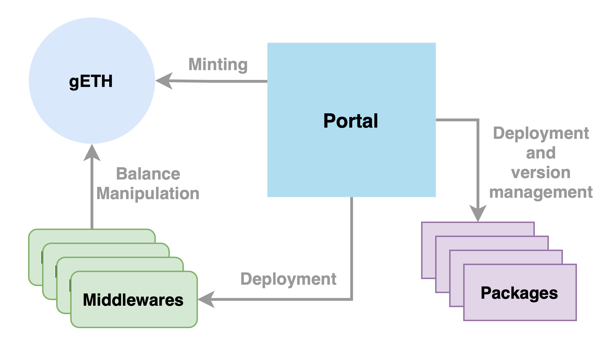
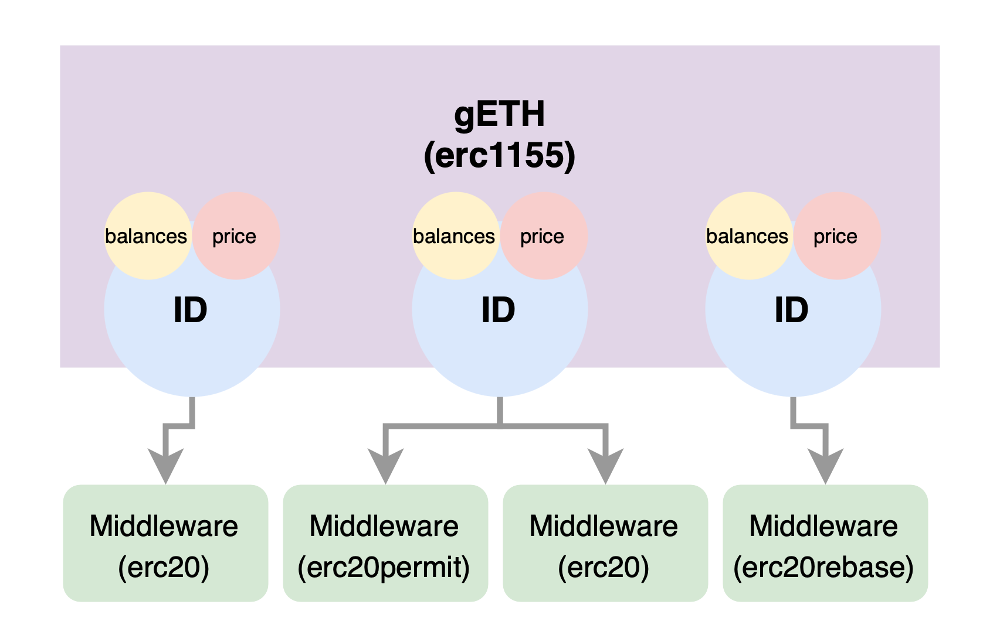

# Contracts

## Understanding the Contracts

The Staking Library utilizes a Modular Architecture with Packages that relies on Limited Upgradability.

Limited Upgradability, based on UUPS, provides a version management system that is similar to git:

* A remote branch keeps track of the latest version of a repository, like Github.
* Owner of local branch can choose to upgrade their local repository, pulling a referance to the new implementation from the remote branch.

Similarly,

* Portal keeps track of the packages and the latests versions of them.
* An instance of a given package can be upgraded to the latest version by its owner.

Modular Architecture means all Packages should be built by inheriting one or multiple modules, which are abstract contracts.

* Modules can also be built on top of other modules.
* Modules and Packages rely on Interfaces which allows developers to define subgroups with different types of packages.
* Modules delegate nearly all their functionality to libraries, which decreases the deployment costs and creates reusable implementations.
* Libraries can utilize other libraries, keeping their functionality isolated, while enabling maximum flexibility.
* Libraries can extend other libraries, providing additional functionality with minimal changes on the structure of the codebase.

Thus resulting in:

* A good understanding of the low level smart contract development is maintained.
* Functionalities are grouped within relation to others.
* Seperation of Concerns is applied accordingly.
* A safer development process is provided for the developers.
* Easier to understand, compared to other modular smart contract approachs.
* Easier to audit as comingling of the functionalities is prevented. Therefore, more secure smart contracts.
* Seamless smart contract upgrades which increases the pace of the development process, and decreases the probabilty of developer mistakes.

## Contracts Overview

## Contents

### gETH

gETH is a Databases of **Balances** and **Prices** with extra **Scalability**. It is designed to host all of the Staking Derivatives, created by Portal.

gETH is an ERC1155 contract, it can hold many different token balances with different IDs.
Additionally, gETH can provide information on the derivative prices, acting as the central oracle. However, only Portal can upgrade this prices.

Finally, gETH contains a very unique implementation called `middlewares`.
ERC-1155 tokens are not compatible within the DeFi ecosystem, thus they need to be mutated for public usage.  Every Derivative has a different use-case, depending on the represented Protocol, therefore it doesn’t come with a preset implementation.
Middlewares are external contracts used to manage the underlying assets for different purposes.
Unlocking infinite flexibility!

### Portal

Portal is the Main contract of the Staking Library.

Portal is built by inheriting StakeModule and GeodeModule modules.

> While **Portal is a package** by definition, it is a special one and does not rely on any other contract for its version management, rather it handles upgrades by itself.

Portal contains many functionalities:

* Pool creation
* Operator Marketplace
* Validator creation
* Oracle Operations
* Middleware releases
* Package releases and version management

### Helpers

Please see this document for information about [Helpers](./helpers/Readme.md).

### Globals

Please see this document for information about [Globals](./globals/Readme.md).

### Interfaces

Please see this document for information about [Interfaces](./interfaces/Readme.md).

### Modules

Please see this document for information about [Modules](./modules/Readme.md).

### Packages

Please see this document for information about [Packages](./packages/Readme.md).

### Middlewares

Please see this document for information about [Middlewares](./middlewares/Readme.md).
